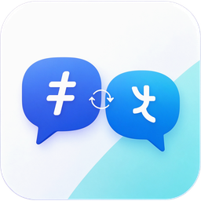

# ChatTranslate

**面向本地 Ollama 模型设计的 Windows 桌面翻译工具** —— 划词翻译 / 截图 OCR / 输入翻译三合一。

翻译全部由本机运行的 [Ollama](https://ollama.com) 模型完成（默认 [Hy-MT2](https://huggingface.co/Tencent-Hunyuan)），
**全程离线，不经过任何第三方服务**：不需要账号、不消耗额度、没有内容外传风险。



## 🙌 欢迎提交 PR：一起把它改成通用在线 API 客户端

这个项目的定位很明确 —— **为"本地模型"这个前提做的设计**，所以它的技术选择未必适合在线 API：

| 为本地模型做的选择 | 换成在线 API 需要改的地方 |
|---|---|
| 没有鉴权层（本机 Ollama 不需要 key） | 加 API Key 管理、请求签名、错误码映射 |
| 请求体直接传 Ollama 私有参数<br>（`keep_alive` / `num_ctx` / `num_predict`） | 映射到各家参数名，或按 provider 分支 |
| 流式解析 Ollama 的 NDJSON | 换成 OpenAI 兼容的 SSE，或按 provider 分支 |
| 无并发控制（本机模型串行就够） | 加并发/限速/重试退避，否则很容易被限流 |
| 无计费与配额概念 | 加 token 统计、额度提示 |

**这些改造都不难，我很欢迎有人来做。** 具体入口见下面的[「改造成通用 API」](#改造成通用-api)一节，
`Services/OllamaClient.cs` 就是这个项目里唯一需要动的地方。

### 怎么参与

1. **提 Issue 说想法** —— 尤其是想接哪家 API、接口怎么设计。先讨论再写代码能少走弯路。
   [提交 Issue →](https://github.com/Cle2333/ChatTranslate/issues)
2. **Fork → 改 → 提 PR**。没有严格的流程要求，能编译通过、改动能说清楚原因就行。
3. 我不太会写英文文档，代码注释和 README 都是中文——**提 PR 用中文也完全没问题**。

如果你只是想要一个能用的版本，不必等：直接 fork 自己改就好。

## 功能

- **划词翻译**：开启监听开关后，选中文字即弹出译文（无需按快捷键）
- **长文分段**：超长文本自动按语义边界分段翻译再拼回，划词上限默认 20000 字符且可调
- **截图 OCR**：截图冻结 → 框选 → 系统 OCR 识别 → 译文替换原文
- **输入翻译**：对话式输入，支持多轮上下文
- **对话归档**：翻译历史可右键归档 / 删除，归档的对话可恢复
- **主题**：跟随系统 / 亮色 / 深色
- **本地模型切换**：主界面与设置页都能切换 Ollama 里的已装模型（7B / 1.8B 等）

## 安装

下载 Releases 里的 `ChatTranslate-Setup-*.msi` 双击安装。会走标准的安装向导：

**欢迎 → 许可协议 → 选择安装位置 → 确认安装 → 完成**

- 默认装到 `C:\Program Files\ChatTranslate\`，**安装位置可以改**
- 自动创建开始菜单与桌面快捷方式
- **在「设置 → 应用 → 已安装的应用」里可以正常卸载**，不留残留

安装包自带 .NET 运行时，**目标机器不需要预装任何东西**。

> 也提供免安装的单文件版（`ChatTranslate.exe`）：解压即用，配置写在 `%APPDATA%\ChatTranslate\`，程序目录不落任何文件。不想装就用这个。

## 环境要求

- Windows 10 1809+ / Windows 11
- **Ollama**（[下载](https://ollama.com/download)），以及一个翻译模型（见下）
- 系统 OCR 语言包（仅截图 OCR 需要）：设置 → 时间和语言 → 语言和区域 → 语言 → 添加语言 → 可选功能 → 勾选「光学字符识别」

## 模型准备

有两条路，都可行。**推荐 B**——用官方权重，模板可控。

### A. 直接从 Ollama 拉社区包（最省事）

```bash
ollama pull kaelri/hy-mt2:1.8b-q4_K_M
```

### B. ModelScope 下载官方 GGUF 后本地导入（推荐）

```bash
# 1. 下载官方 GGUF（腾讯混元，7B 约 4.6 GB）
curl -L -C - -o Hy-MT2-7B-Q4_K_M.gguf \
  "https://modelscope.cn/api/v1/models/Tencent-Hunyuan/Hy-MT2-7B-GGUF/repo?Revision=master&FilePath=Hy-MT2-7B-Q4_K_M.gguf"

# 2. 把 tools/Modelfile 里的 FROM 改成该 GGUF 的绝对路径，然后导入
ollama create hy-mt2:7b-q4km -f tools/Modelfile
```

可用档位：`Q4_K_M` 4.62 GB / `Q6_K` 6.16 GB / `Q8_0` 7.98 GB。
显存吃紧可以换成 1.8B：把上面的 7B 换 1.8B 即可（`Hy-MT2-1.8B-GGUF`，Q4_K_M 约 1.13 GB）。

> **为什么选 B**：Ollama 上**没有腾讯官方账号**，现存的 hy-mt2 包都是社区转包；
> 走 ModelScope 拿到的是**官方账号发布的权重**，且能从 GGUF 里读出权威的 chat template。
>
> 控制 token（`<|startoftext|>` / `<|extra_0|>` / `<|eos|>`）由 GGUF 内嵌的官方 Jinja 模板处理，
> **无需手写 `TEMPLATE`**。若照抄社区 Ollama 包的模板反而会出错——它们用的是另一套 token。

### 7B 还是 1.8B？

两者都可用，本机（RTX 4060 Laptop 8GB）实测：

| | 1.8B (Q4_K_M) | 7B (Q4_K_M) |
|---|---|---|
| 速度 | **135.8 tok/s** | 47.8 tok/s |
| 显存 | **1.66 GB** | 5.41 GB |
| 质量 | 直译倾向明显 | 自然、会重排语序 |

差距只在"需要理解而非直译"的句子，例如成语：`道高一尺，魔高一丈。`
7B 给 `The more the good rises, the higher the evil climbs.`，
1.8B 给 `When the path is one foot high, the demons are a hundred feet tall.`（把「道」当成了"路径"）。

**显存够就用 7B；要快或显存紧就 1.8B。** 界面里可以随时切换，不用改配置。

## 技术栈

| 层 | 选型 |
|---|---|
| 框架 | C# / WPF，目标框架 `net8.0-windows10.0.19041.0` |
| UI | [WPF-UI](https://github.com/lepoco/wpfui)（Fluent 2 / Windows 11 设计语言） |
| OCR | `Windows.Media.Ocr`（系统内置，同进程调用，零外部依赖） |
| 翻译 | 本地 Ollama + Hy-MT2 |
| 存储 | SQLite（会话历史） |
| 取词 | UI Automation `TextPattern` 优先，回退模拟 `Ctrl+C` |

目标框架选 `net8.0-windows10.0.19041.0` 而不是普通的 `net8.0-windows`，是为了能直接调用 WinRT API——这让 OCR 变成一次普通的函数调用，而不是起一个子进程再序列化结果。

## 构建

```bash
dotnet build src/ChatTranslate/ChatTranslate.csproj -c Debug -p:Platform=x64
```

## 发布

### 单文件（免安装）

```bash
dotnet publish src/ChatTranslate/ChatTranslate.csproj -c Release -r win-x64 \
  --self-contained true -p:PublishSingleFile=true \
  -p:IncludeNativeLibrariesForSelfExtract=true -p:DebugType=none -o publish
```

产物为单个 `ChatTranslate.exe`，解压即用，目标机器无需安装 .NET 运行时。

### MSI 安装包

需要 [WiX](https://wixtoolset.org/) 与它的 UI 扩展（**UI 扩展必需**——没有它 MSI 会没有任何界面，双击就直接装完）：

```bash
dotnet tool install --global wix --version "5.*"
wix extension add -g "WixToolset.UI.wixext/5.0.2"
./installer/build-installer.sh
```

脚本会先 publish 再打包成 `installer/out/ChatTranslate-Setup-<版本>-x64.msi`。

改完打包逻辑建议跑一遍往返测试（它用同一个 .wxs 建一个 perUser 变体，**真的装一遍、验一遍、卸一遍**，
不需要管理员）：

```bash
./installer/test-installer.sh
```

> ⚠️ 别用 WiX v7 —— 它要求接受 Open Source Maintenance Fee 协议（商业使用需付费）。
> v5 仍是 MIT 免费的。

## 目录结构

```
src/ChatTranslate/
├── Assets/        # 应用图标（多尺寸 ico 与各尺寸 PNG）
├── Core/          # 底层能力：取词、截图、OCR、热键、剪贴板、主题
├── Data/          # 配置、SQLite 会话存储、数据模型
├── Services/      # Ollama 客户端、语言表、翻译编排  ← 改通用 API 看这里
└── Views/         # 界面：主窗、设置窗、语种选择窗、结果窗、全屏框选层
installer/         # WiX 安装包定义、构建脚本、往返测试
docs/              # README 用图
tools/             # Modelfile（模型导入）、make_icon.py（图标）、make-license-rtf.py
```

## 设计要点

- **剪贴板保护**：取词的回退路径会占用剪贴板，因此做已知格式的备份还原。刻意**不**枚举未知的 vendor 私有格式——Office 等应用会把指向自身内部数据的指针放进剪贴板，替换再还原会使指针悬空，崩溃的是对方进程。
- **取词双路**：优先 UI Automation（不产生副作用），失败才模拟 `Ctrl+C`。用剪贴板序号变化判断复制是否真的发生，避免把剪贴板里的旧内容当成选中文本。
- **DPI 感知**：`app.manifest` 声明 PerMonitorV2。缺少它的话，在多显示器或高缩放比下截图与窗口定位都会偏移。
- **配置与数据位置**：一律写 `%APPDATA%\ChatTranslate\`，**绝不写程序目录**——单文件 exe 可能被放在只读目录下。
- **模型常驻**：请求体带 `keep_alive`（默认 `30m`），否则按 Ollama 默认的 5 分钟计时，模型被卸载后下一次翻译要先等它载回显存（实测 7.05 s）。
- **输出上限**：请求体带 `num_predict`（4096）。没有它就没有任何终止条件——llama.cpp 在上下文写满后会 context shift 继续生成，模型陷入复读时会无限产出（实测 20 万字符仍未结束），界面表现为永远「生成中」。
- **撞上限要说话**：达到输出上限时 Ollama 返回 `done_reason="length"`，界面会提示「译文达到输出上限，可能不完整」，而不是给一段看起来完整实为断尾的译文。
- **输入框**：能容纳 10 行、超出可滚动，**没有字数上限**；状态栏实时显示字数与行数。
- **强调色固定为品牌蓝** `#0A84F4`，不跟随 Windows 系统强调色——否则用户气泡与选中项的配色会随机器而变。主题可切但强调色不变（见 `Core/AppTheme.cs`）。

## 改造成通用 API

改造点是收敛的：**`Services/OllamaClient.cs` 是唯一与模型服务耦合的文件**。
其余代码通过 `TranslationService` 拿到译文，不关心后端是谁。

需要做的事：

1. **抽一层接口**：把 `OllamaClient` 的公开方法提成 `ITranslationClient`，
   新增 `OpenAiCompatClient`（覆盖 OpenAI / DeepSeek / Moonshot / 智谱等一大批兼容端点）。
2. **配置加 provider**：`AppConfig` 增加 `Provider` / `ApiKey` / `Endpoint` / `ModelName`。
   ⚠️ **API Key 不要明文写进 `config.json`** —— 那是明文 JSON。
   建议用 DPAPI（`ProtectedData.Protect`）加密后存，或交给 Windows 凭据管理器。
3. **参数映射**：`num_predict` → `max_tokens`、`temperature` / `top_p` 同名，
   `keep_alive` / `num_ctx` 在线 API 没有对应概念、直接丢弃。
4. **流式差异**：Ollama 是 NDJSON，OpenAI 兼容端点是 SSE（`data: {...}\n\n`，
   以 `data: [DONE]` 结束）。`TranslationService` 里的流式回调要按 provider 分支。
5. **并发与限流**：本地模型串行就够，在线 API 需要重试退避与速率控制。

`Services/ModelCatalog.cs`（模型清单获取）目前也假设了 Ollama 的 `/api/tags`，
多 provider 时要按 provider 分支——或者在线 API 直接让用户手填模型名。

## 开发阶段

| 阶段 | 内容 | 状态 |
|---|---|---|
| P0 | 底层能力验证（OCR / 取词 / 热键 / 剪贴板 / 翻译 / 单文件发布） | 已完成 |
| P1 | 会话式翻译核心（输入翻译 + 会话存储 + 主界面 + 语言选框 + 截图 OCR） | 已完成 |
| P2 | 划词翻译（被动监听 + 浮窗） | 已完成 |
| P3 | 截图 OCR 译文替换渲染 | 已完成 |
| P4 | 打磨（模型常驻 / 加载提示 / 主题切换 / 应用图标 / 语种选择窗） | 已完成 |
| P4.5 | 长文分段翻译（划词上限提到 20000 且可调）· 对话归档与恢复 | 已完成 |
| P5 | 多引擎（接入在线 API，与本地 Ollama 并存） | 待做 —— **欢迎提 PR 认领** |

## 界面说明

- **侧边栏**：翻译历史（点击切换会话 · 右键归档或删除）· 已归档的对话 · 划词翻译开关 · 设置
- **主区**：对话气泡（用户右侧 / 译文左侧）；截图 OCR 的用户气泡直接显示截图
- **输入区上方**：输入语言（含「自动检测」）· 目标语言 · 互换按钮 · 本地模型选框
- **状态栏**（右对齐）：语言对 · 版本 · Ollama 状态 · 输出速度 · 上下文用量 · 输入字数

### 长文本与分段

超过单次请求上限的输入（默认约 2000 字，随设置里的「最长字符数」与模型上下文变化）
会按语义边界切成多段，逐段翻译后按原文结构拼回去 —— 段间的换行与空行原样保留，
整段文字一字不差。分段期间浮窗不会因为误点外部而关闭（否则一次误点就丢掉已翻好的部分）。

### 对话归档

翻译历史可右键归档：归档不删数据，只是从主列表收起来，进「已归档的对话」窗口，
可在那里恢复或删除。删除会连同该会话的截图一起清理，且需二次确认。

### 语言与自动换向

输入语言为「自动检测」时：若检测出的原文语言与目标语言相同，会**自动译为另一种**（中↔英），
并在语言选框右侧给出提示。这是为了避免"把中文翻成中文"这种空转。

也可以显式指定输入语言——显式指定时只按所选执行，不做任何自动换向。

支持的语种来自 Hy-MT2 官方列表（37 种）。默认下拉里只放中英两种，
其余在「设置 → 语言 → 下拉里显示哪些语种」里勾选。

## 已知问题

- **划词取词依赖目标应用暴露 UI Automation 文本**。Electron / 部分自绘界面的应用
  拿不到文本，会回退到模拟 `Ctrl+C`，此时会短暂占用剪贴板。
- **截图 OCR 需要系统装了对应语言的 OCR 包**，否则识别结果为空且不报错。
- **仅 Windows**。OCR 用的是 `Windows.Media.Ocr`，换平台需要替换整个 OCR 层。

## 许可证

[MIT](LICENSE)
